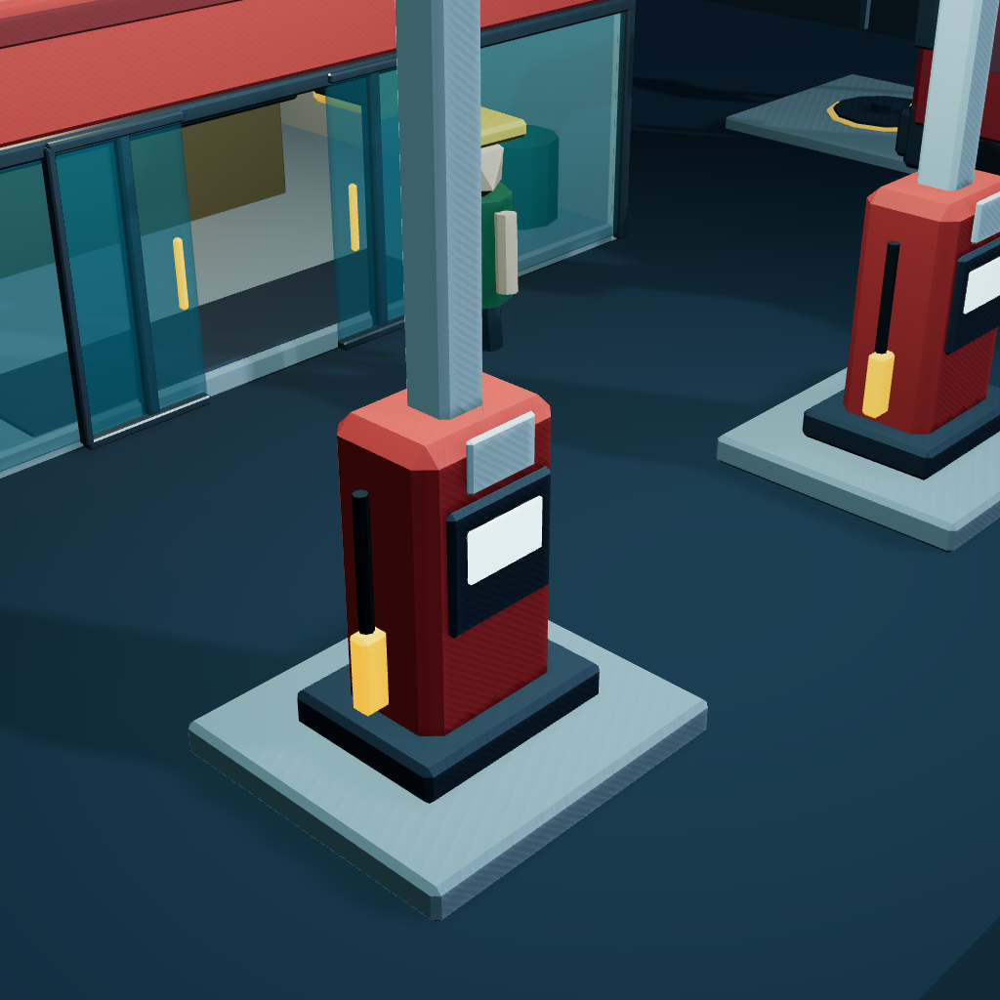
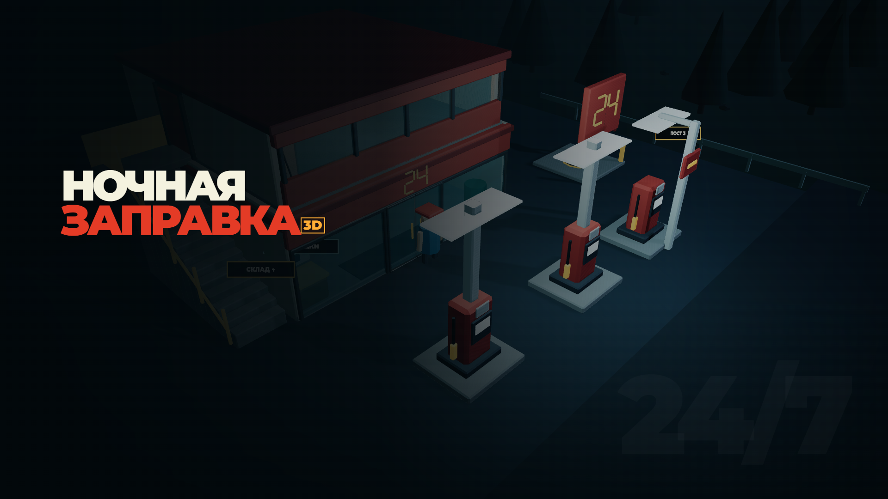
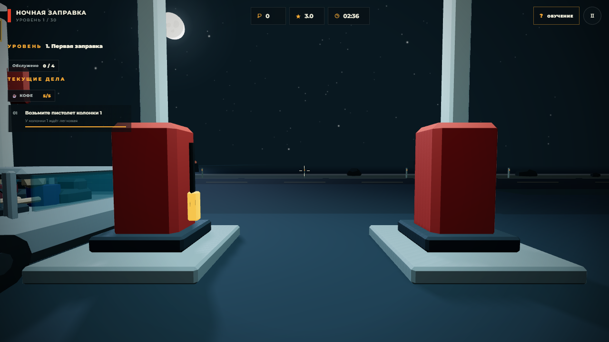
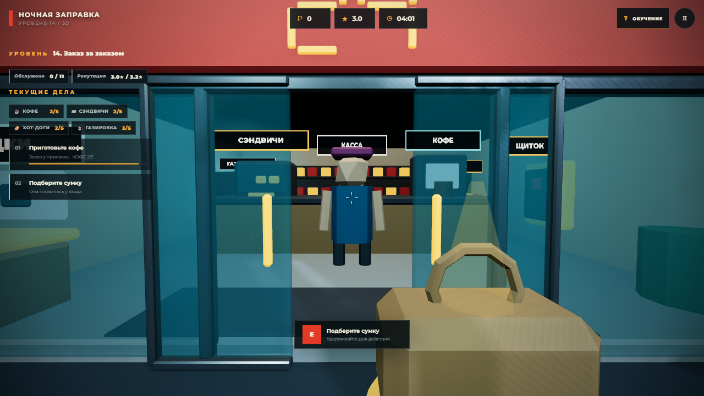
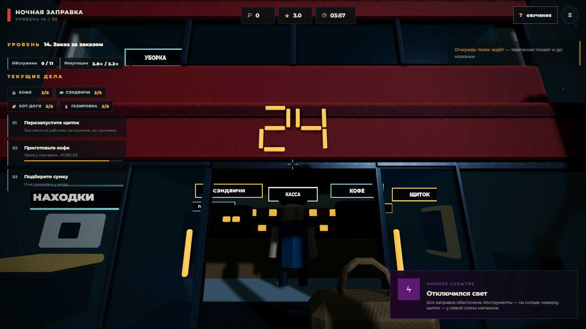
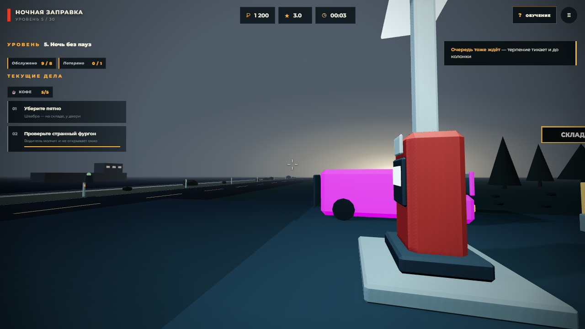

<div align="center">



# ⛽ Ночная заправка 3D

**Браузерный 3D-симулятор ночной смены на придорожной заправке.**  
Заправляйте машины, готовьте кофе и еду, следите за магазином, поддерживайте порядок и разбирайтесь со странностями, которые случаются после полуночи.

[](https://threejs.org/)
[](https://vite.dev/)
[](https://playwright.dev/)
[](https://zaplavs.github.io/night-gas-station-3d/)

### 🎮 [Играть онлайн](https://zaplavs.github.io/night-gas-station-3d/)

</div>



## Об игре

Вы заступаете на ночную смену на небольшой заправке у трассы. Клиенты приезжают за топливом, кофе и едой, магазин нужно пополнять, территорию — поддерживать в порядке, а оборудование — чинить, когда оно выходит из строя.

По мере смены обычная работа постепенно перемешивается со случайными и странными событиями. Ваша задача — обслужить как можно больше клиентов, сохранить репутацию и закончить ночь с хорошей выручкой.

Игра собрана для публикации через GamePush на Пикабу Играх, и цикл смены в ней закончен: три заправочных поста, магазин с живыми покупателями и четырьмя товарами, склад на втором этаже, приёмка топлива, уборка, погода, экономика, репутация, улучшения станции и семь типов ночных событий.

## ✨ Что уже есть в игре

- **Трафик.** Машины приезжают издалека по своей полосе трассы, сворачивают на площадку и паркуются носом к магазину. После обслуживания они включают заднюю передачу, отъезжают от колонки, выходят на дорогу и уезжают за горизонт. Мимо заправки изредка проезжает попутный транспорт — с фарами, стопами и фонарями заднего хода. Трасса отнесена от колонок настолько, чтобы между ней и площадкой поместились разные полосы: разворот у колонки, подъезд к посту и выезд не идут по одной линии и не спорят за место.
- **Три поста.** Два поста стоят под навесом у магазина, третий — в левом крыле площадки, под собственной мачтой. Машина едет туда, когда первые два заняты, поэтому бегать приходится дальше. На части уровней третий пост закрыт табличкой «ЗАКРЫТО», и очередь идёт через оставшиеся.
- **Очередь ждёт по часам.** Пока посты заняты, остальные стоят в линии у съезда — и терпение у них тикает там же, а не только у колонки. Таймер каждого ждущего виден в панели дел, одна строка под него держится всегда. Не дождавшись, клиент выезжает из линии и уходит на трассу — это потерянный клиент, как и тот, кто не дождался у поста.
- **Четыре типа клиентов.** Легковая — мерка, по которой считается всё остальное. Мотоцикл заправляется за пару секунд, но и ждать почти не станет, а денег с него половина. Фура стоит у колонки вдвое дольше и платит вдвое больше. Автобус привозит в магазин сразу три заказа и не уедет, пока не обслужат последнего пассажира. Кто именно приедет — часть уровня: у каждой ночи свой состав потока, и у наплыва он может быть свой, поэтому «колонна фур» — это действительно колонна фур.
- **Крупным нужен левый пост.** Фуре и автобусу между колонками под навесом не развернуться, поэтому они идут прямо на третий пост, минуя очередь, — и занимают его целиком. Пока такой клиент на станции, второго не будет, а ночь без третьего поста обходится без них вовсе. В очереди место тоже считается по габаритам: мотоциклы стоят плотнее легковых.
- **Заправка со шлангом.** Сначала нужно снять пистолет с нужной колонки, затем подойти к лючку автомобиля и заправить его. Пистолет виден в руках, а шланг физически тянется от колонки до игрока и возвращается после обслуживания.
- **Топливо в резервуаре.** На некоторых уровнях заправки считают: запас виден в панели дел, каждая машина забирает одну единицу. Когда резервуар пуст, пистолет не снять — колонка честно пишет, что топлива нет.
- **Бензовоз.** Приезжает по расписанию ночи и встаёт на третий пост, занимая его целиком. Рукав берут из шкафа со стороны станции и несут к горловине резервуара в левом крыле — там же, под табличкой «РЕЗЕРВУАР». Слив занимает время, но заполняет запас полностью и оплачивается.
- **Спешащие клиенты.** Жёлтые машины: платят вдвое, но ждут вдвое меньше обычного. Из-за них порядок обслуживания перестаёт быть очевидным.
- **Погода.** Ночь бывает ясной, дождливой или туманной. В дождь по площадке идут струи и мокнет бетон, в туман исчезают трасса и звёзды, а фары видно в последний момент.
- **Водители.** В салонах легковых автомобилей видны low-poly водители. Кабина подозрительного фургона просматривается через окна, но оба сиденья в ней пусты.
- **Покупатели.** Пока вы заправляете машину, её водитель выходит и идёт в магазин: открывает двери, встаёт к кассе и ждёт заказ. Из легковой нередко выходят двое — водитель и его спутник, каждый со своим заказом. Уходит именно тот, кто сидел в салоне, — место пустеет, а куртка у покупателя та же, что была видна за стеклом; из автобуса так выходят трое, а один остаётся за рулём. Мимо покупателя не пройти насквозь: он такое же препятствие, как ящик. Колонка и прилавок работают одновременно, и машина не уедет, пока её покупатель не вернётся. Не дождался — уезжает недовольным, как и тот, кому не залили бак.
- **Магазин.** Кофе и витрина с едой стоят на прилавке, роликовый гриль с хот-догами и холодильник с газировкой — в подсобке за ним. Заказ готовят у нужного аппарата и выдают на кассе, перед тем, кто его ждёт. Хот-дог дороже и дольше всех, газировка — самая быстрая.
- **Предметы в руках.** Всё, что игрок взял, видно в нижней части экрана: стакан кофе с паром, сэндвич, коробка товара, забытая сумка, швабра и инструменты. Предметы покачиваются при ходьбе, ведут за поворотом камеры и отыгрывают само действие — шваброй возят по полу, отвёрткой крутят.
- **Инвентарь.** Весь он стоит на складе у двери: на верстаке ящик с инструментом, рядом швабра с ведром. Инструментом чинят заклинившую колонку и выбитый щиток, шваброй убирают разлитый кофе — а пока пятно на полу, прилавок закрыт: заказы не готовят и не выдают, и ожидание у кассы на это время замирает. И то и другое можно взять и вернуть в любой момент; если руки понадобились под груз, они возвращаются на место сами. За инвентарём стоит сходить заранее: ночью подниматься некогда.
- **Море за трассой.** По ту сторону дороги — узкий песчаный пляж с валунами, полосы прибоя и вода до горизонта. На воде лежит лунная дорожка ровно с той стороны, где нарисована луна, у берега мигают два буя, а вдали стоит сухогруз с освещёнными окнами. На рассвете берег видно целиком.
- **Ночное небо.** Над трассой висит луна с ореолом, вокруг — звёздное небо с млечным путём и редкими метеорами. Лунный свет падает именно оттуда, где нарисована луна, а само небо не ловит туман и едет за камерой, поэтому кажется бесконечно далёким.
- **Рассвет.** Последнюю минуту смены небо отрабатывает само: над трассой справа разгорается тёплая полоса, звёзды и млечный путь гаснут, луна бледнеет, туман редеет, а площадка светлеет. Конец смены становится видно раньше, чем на него посмотришь в часы, — и на этом же рассвете заканчивается кампания.
- **Прыжок.** `Space` на ПК и кнопка «Прыжок» на телефоне. Прыжок работает только по вертикали: перепрыгнуть прилавок, колонку или машину нельзя, зато предмет в руках отстаёт в полёте и проседает при приземлении.
- **Склад на втором этаже.** Всё, чем торгует прилавок, и весь инвентарь лежат наверху: наружная лестница справа от магазина ведёт на площадку, дверь склада открывается сама. Четыре стеллажа с цветными лентами — кофе, сэндвичи, хот-доги, газировка — а у двери верстак с инструментом и швабра с ведром. Коробку можно взять в любой момент: и по заданию смены, и заранее, пока очереди нет; если запас полон, полка ничего не отдаст. Передумали — коробка возвращается на место. Витрины внизу пустеют на глазах: по кофейнику, сэндвичам, сосискам на гриле и банкам в холодильнике видно, сколько осталось.
- **Итоги смены.** На рассвете смена закрывается: показываются заработок, число обслуженных клиентов, репутация и рекорд заработка за смену. Оттуда же открывается станция и предлагается rewarded-реклама.
- **Станция за ночную выручку.** Деньги тратятся не на проценты в невидимой формуле, а на саму заправку: рабочие ботинки, вторая кофемашина на прилавке, прожекторы над площадкой, подсвеченный щит у трассы, скоростные насосы, третий пост навсегда и тележка для коробок, которая заменяет четыре подъёма на склад одним. Каждое улучшение покупается один раз и стоит от одной до трёх ночей работы, открывается по ходу кампании и остаётся с игроком навсегда — поэтому работать лучше, чем «на зачёт», выгодно. Всё выкупленное видно на площадке: мачты со светом, щит у дороги, вторая машина за прилавком, тележка у стеллажей. Ночи, где колонки закрыты аварией, выкупленный пост не открывает — там закрытая колонка и есть задание.
- **Два языка.** Игра целиком переведена на английский: интерфейс, тридцать ночей кампании, достижения, улучшения станции, задания, тосты, девять экранов обучения со своими кадрами и даже надписи на площадке — «КАССА» становится TILL. Язык берётся у площадки через SDK, а без неё — у браузера; всё, кроме русского, считается английским. В адресе язык можно задать руками: `?lang=en`.
- **ПК и мобильные устройства.** Отдельное управление мышью и клавиатурой, отдельный сенсорный интерфейс: стик, свайп и экранные кнопки. Смена играется горизонтально, поэтому в портрете телефон сначала просят повернуть.
- **GamePush.** Облачное сохранение и реклама с безопасным fallback на локальный прогресс.

## 🎯 Кампания

30 уровней, шесть глав по пять ночей. Уровень — это данные в `src/content/levels.js`, а не ветка в игровом цикле: название, длительность, цель, плотность потока, терпение клиентов, стартовые запасы, разрешённые события, расписание гарантированных происшествий и окна наплыва.

- **Главы.** «Первые ночи» — только колонка и пистолет. «Магазин» — кофе, еда и склад. «Три поста» — очередь, левый пост и те, кто спешит. «Железо» — поломки, закрытая колонка и приёмка топлива. «Темнота» — отключения света. «Хаос» — всё выученное одновременно.
- **Цели.** Обслужить N машин, заработать сумму, удержать репутацию, не упустить больше N клиентов. Прогресс виден в панели дел всю смену; на итогах показано, какая именно цель не сошлась и на сколько. Не зачтено — уровень повторяется, деньги и выкупленное остаются.
- **Наплывы.** В расписании уровня есть окна, когда машины идут в два-три раза чаще, а очередь становится длиннее. Наплыв объявляется карточкой.
- **Сценарные события.** Часть происшествий гарантирована расписанием: на 21 уровне свет гаснет на 60-й секунде, на 30-м — поломка, два бензовоза, два отключения света и три волны машин.
- **Что открывается и когда.** Кофе — с 3-го уровня, дождь — с 4-го, еда — с 6-го, склад — с 7-го, хот-доги — с 8-го, туман — с 9-го, очередь и мотоциклы — с 11-го, третий пост и фуры — с 12-го, спешащие клиенты — с 13-го, газировка — с 14-го, поломки — с 16-го, работа на одной колонке — с 17-го, приёмка топлива — с 18-го, автобусы и странный фургон — с 19-го, отключения света — с 21-го.
- **Экзамены.** Каждый пятый уровень требует больше, чем любая ночь главы до него, и собирает её механики вместе.
- **Меню уровней.** Кнопка «УРОВНИ» в главном меню (и ссылки с итогов смены и с финала) открывает все шесть глав: пройденные ночи отмечены, следующая подсвечена, остальные закрыты. На каждой плитке — цель ночи и метки того, чем она отличается: «3 поста», «дождь», «бензовоз», «спешат», «темнота». Любую пройденную ночь можно переиграть — прогресс и деньги при этом не теряются, а «Продолжить смену» всегда ведёт к первой непройденной.
- **Достижения.** 35 наград: за механики смены, приёмку топлива, товары с витрины, десять фур и полный автобус, пройденные главы, ночи без единого потерянного клиента, рекорд выручки и пару глупостей. Каждая считается по одному счётчику, поэтому в списке всегда видно, сколько осталось — «44 / 100». Кнопка «ДОСТИЖЕНИЯ» в главном меню; то, что уже заслужено старым сохранением, выдаётся задним числом и молча.
- **Бесконечный режим.** Открывается после 30-го уровня — кнопкой на экране финала кампании или в меню уровней: те же правила, цели нет, давление растёт с каждой ночью, а погода меняется по кругу — ясно, дождь, туман.

## 📸 Скриншоты

<table>
  <tr>
    <td></td>
    <td></td>
  </tr>
  <tr>
    <td></td>
    <td></td>
  </tr>
</table>

## 🕹️ Управление

| Действие | ПК | Телефон / планшет |
| --- | --- | --- |
| Движение | `WASD` | Левый виртуальный стик |
| Обзор | Мышь | Свайп по правой части экрана |
| Бег | `Shift` | — |
| Прыжок | `Space` | Кнопка «Прыжок» |
| Действие | удерживать `E` | Кнопка «Действие» |
| Освободить курсор | `Esc` | — |

На ПК обзор мышью включается кликом по игровому окну. Кнопка **«Обучение»** в правом верхнем углу показывает девять иллюстрированных подсказок и расположение рабочих зон.

## 🚀 Быстрый запуск

Требуется установленный Node.js и npm.

```bash
git clone https://github.com/Zaplavs/night-gas-station-3d.git
cd night-gas-station-3d
npm install
npm run dev
```

После запуска Vite покажет локальный адрес игры в терминале.

### Продакшен-сборка

```bash
npm run build
npm run preview
```

Готовый билд находится в `dist/`. Его можно размещать как обычный статический сайт — `index.html` уже находится в корне сборки.

## 🧪 Тесты

`npm test` — быстрая проверка без браузера: ассеты, совпадение разметки с кодом, полнота английского словаря, баланс всех 30 уровней (включая запас топлива под цель, товары витрины и терпение спешащих), таблица достижений и миграция сохранений.

```bash
npm test
```

Полный сценарий смены прогоняется в headless Chrome:

```bash
npm run preview
npm run test:e2e
```

E2E-тест ожидает игру по адресу `http://127.0.0.1:4173`. Адрес можно заменить через переменную окружения `TEST_URL`.

## 🧰 Технологии

- **Three.js** — 3D-сцена, освещение, модели и рендеринг.
- **Vite** — dev-сервер и production build.
- **Vanilla JavaScript / ES modules** — игровая логика без UI-фреймворка.
- **Playwright Core** — E2E-проверка игрового сценария.
- **Blender + bpy** — генерация и экспорт low-poly 3D-ассетов.
- **GamePush SDK** — облачный прогресс и рекламная интеграция.

## 📁 Структура проекта

```text
night-gas-station-3d/
├── blender/               # Blender-сцена и генератор 3D-ассетов
├── promo/                 # Обложка, иконка и скриншоты
├── public/
│   ├── models/            # Экспортированные .glb-модели
│   └── tutorial/          # Кадры для экрана обучения
├── src/
│   ├── content/           # Данные: уровни, витрина, транспорт, улучшения, достижения
│   ├── main.js            # Сцена, цикл смены, задания и события
│   ├── customers.js       # Покупатели: маршрут от машины до кассы
│   ├── traffic.js         # Движение автомобилей
│   ├── hands.js           # Предметы в руках от первого лица
│   ├── sky.js             # Луна, звёзды, млечный путь, метеоры и рассвет
│   ├── audio.js           # Звуковая система
│   └── gamepush.js        # Интеграция с GamePush
├── scripts/               # Упаковка билда в архив для площадки
├── tests/                 # Smoke-, E2E-тесты и съёмка скриншотов
├── index.html
└── vite.config.js
```

За что отвечает каждый файл:

- `src/main.js` — сцена, цикл смены, задания, погода и ночные события.
- `src/content/levels.js` — таблица 30 уровней: цели, погода, запас топлива, расписание событий и наплывов.
- `src/content/menu.js` — витрина магазина: где готовят товар, из какого запаса и за сколько.
- `src/content/vehicles.js` — типы клиентов: габариты, время у колонки, деньги, терпение и место в очереди.
- `src/content/upgrades.js` — станция: что выкупается за ночную выручку, почём, когда открывается и что меняет в ночи.
- `src/customers.js` — покупатели: походка, маршрут от машины до кассы и обратно.
- `src/content/achievements.js` — таблица достижений и счётчики прогресса.
- `src/content/shifts.js`, `src/content/progress.js` — выбор конфига уровня, бесконечный режим и миграция сохранений.
- `src/content/i18n.js`, `src/content/en.js` — выбор языка, перевод строк и разметки, английский словарь игры.
- `src/traffic.js` — маршруты машин по трассе и площадке, разгон и торможение, фары, стопы и задний ход.
- `src/hands.js` — предметы в руках: отдельная сцена первого плана, которая рисуется поверх мира.
- `src/sky.js` — луна, звёзды, млечный путь, метеоры и рассвет последней минуты.
- `src/audio.js`, `src/gamepush.js` — звук и интеграция с GamePush.

## 🎨 3D-ассеты

Все модели создаются скриптом `blender/create_assets.py` через `bpy`, оптимизируются под low-poly и экспортируются в `public/models/*.glb`.

Исходная Blender-сцена находится в:

```text
blender/night_station_assets.blend
```

Повторная генерация ассетов в Windows:

```powershell
& 'C:\Program Files\Blender Foundation\Blender 5.2\blender.exe' --background --python blender/create_assets.py
```

## ☁️ GamePush

Перед публикацией через GamePush:

1. Укажите `projectId` и `publicToken` в `index.html`.
2. Создайте в панели GamePush строковое поле игрока с поддержкой JSON и ключом `night_station_save`.
3. Соберите архив для площадки: `npm run release` положит `release/nochnaya-zapravka-3d.zip` с `index.html` в корне — именно в таком виде его принимает GamePush.

Публикация на Пикабу Играх разобрана по шагам в [PUBLISHING.md](PUBLISHING.md): готовые тексты карточки, размеры материалов и таблица требований площадки со ссылками на места в коде.

SDK загружается с нескольких официальных адресов. Игра использует облачный прогресс, но всегда сохраняет локальную копию как резервный вариант: если SDK или реклама заблокированы, основной игровой процесс продолжает работать без ошибок.

Полноэкранная реклама показывается только между сменами и не чаще одного раза в три минуты — интервал площадки отсчитывается от любого показанного ролика. На время ролика смена и звук встают на паузу. Rewarded-реклама доступна добровольно на экране результатов и даёт надбавку **35% от заработка смены, но не меньше ₽50**; кнопка подписана точной суммой, и эта сумма не меняется от того, что уже выкуплено на станции. Если ролик не загрузился, игра говорит об этом прямо и ничего не начисляет.

## 🌅 Как заканчивается смена

На рассвете показываются:

- заработок за смену;
- количество обслуженных клиентов;
- текущая репутация;
- рекорд заработка;
- что из улучшений станции уже по карману.

Оттуда же открывается раздел «СТАНЦИЯ», где ночная выручка превращается в оборудование заправки, — и начинается следующая ночь.

<details>
<summary><strong>Данные для карточки игры</strong></summary>

- **Название:** Ночная заправка 3D
- **Краткое описание:** Заступайте на ночную смену: заправляйте машины, готовьте кофе, следите за магазином и разбирайтесь со странностями, которые случаются после полуночи.
- **Ориентация:** горизонтальная
- **Устройства:** ПК, смартфоны, планшеты

</details>

---

<div align="center">

**[▶ Играть в Ночную заправку 3D](https://zaplavs.github.io/night-gas-station-3d/)**

</div>
